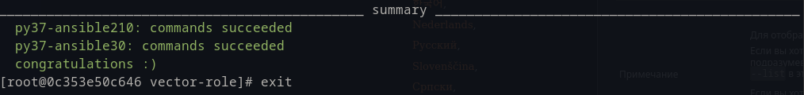

# Role Name

This role sets the vector to the specified version. The default version is the "0.55.0".

## Requirements

## Role Variables

    default:
        vector_version: "0.55.0"
    vars:
        vector_repo_url: base url
        vector_config_dir: config file directory
        vector_config_path: directory with config files
        vector_install_dir: the base installation directory
        vector_data_dir: the path to the application data
        vector_log_dir: the path to the application logs
        vector_user: vector user
        vector_group: vector group

## Dependencies

## Example Playbook

    - name: Intalling vector
      hosts: vector
      tasks:
        - name: Install dependencies
          ansible.builtin.yum:
            name: ["wget", "tar", "gzip"]
            state: present
          become: true

        - name: Include role
          ansible.builtin.include_role:
            name: "{{ 'vector-role' }}"

## License

MIT

## Author Information

## Other

Tox commands succeeded

